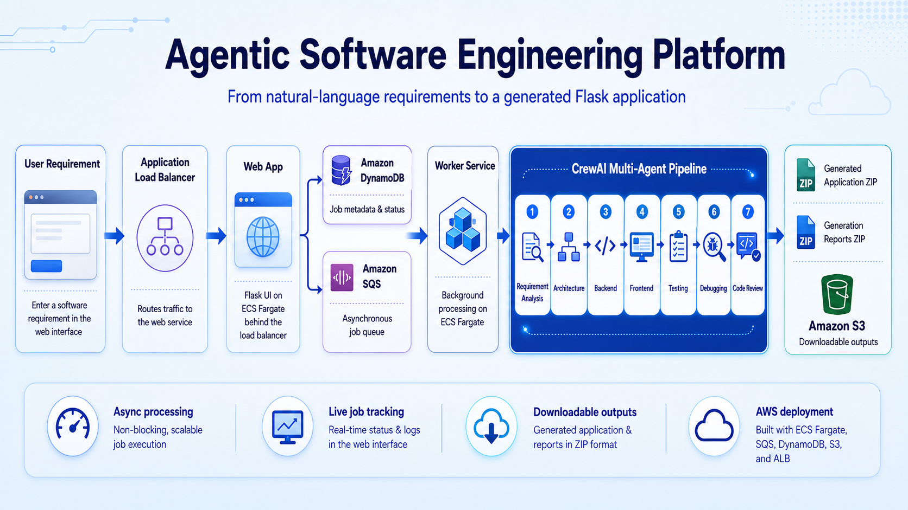

# Agentic Software Engineering Platform

A cloud-deployed, multi-agent software engineering platform that converts natural-language requirements into runnable Flask applications, automated tests, and structured engineering reports.

The platform uses a coordinated CrewAI workflow to analyse requirements, design the solution, generate backend and frontend code, create tests, debug failures, review the implementation, package the outputs, and make them available for download.

The latest version is deployed on AWS and supports asynchronous job processing, live progress tracking, isolated job execution, retry handling, and private S3 output storage.

---

## Architecture and Video Demo

<p align="center">
  <a href="https://youtu.be/xKhzaNuU3kg">
    
  </a>
</p>

<p align="center">
  <strong>Click the architecture image to watch the full demonstration</strong>
</p>

<p align="center">
  <a href="https://youtu.be/xKhzaNuU3kg">▶ Watch on YouTube</a>
</p>

The video demonstrates the complete end-to-end workflow:

1. A user submits a natural-language software requirement through the browser.
2. The web service creates a job record and sends the job to Amazon SQS.
3. A separate ECS worker processes the request through seven specialist AI agents.
4. Progress is displayed on a live job-status page.
5. The generated application and engineering reports are packaged separately.
6. Both ZIP files are uploaded to Amazon S3.
7. The files are downloaded and inspected in Visual Studio Code.
8. The generated Flask application is run locally and functionally tested.

---

## Latest Release

### `v1.0.0` — AWS Portfolio Release

This release adds a production-oriented cloud architecture around the original CrewAI workflow.

Key improvements include:

- Deployment with Docker and Amazon ECS Fargate
- Separate web and worker services
- Application Load Balancer for browser traffic
- Amazon SQS for asynchronous job processing
- Amazon DynamoDB for job state and progress tracking
- Amazon S3 for private output storage
- Amazon ECR for Docker image storage
- AWS Secrets Manager for API keys
- Per-job isolated workspaces
- Retry and failure handling
- Live status polling in the browser
- Separate application and report ZIP downloads
- Health-check endpoints for container monitoring

---

## Project Overview

The Agentic Software Engineering Crew accepts a natural-language software requirement and generates a complete application through a structured sequence of specialist agents.

The generated output can include:

- Flask backend source code
- HTML, CSS, and vanilla JavaScript frontend
- JSON API endpoints
- In-memory data models
- Input validation and HTTP error handling
- Automated pytest tests
- `requirements.txt`
- Generated application `README.md`
- Requirement analysis report
- Architecture report
- Backend development report
- Frontend development report
- Test report
- Debugging report
- Final code-review report
- Downloadable application ZIP
- Downloadable engineering-report ZIP

---

## Cloud Architecture

```text
Browser
   |
   v
Application Load Balancer
   |
   v
ECS Fargate Web Service
   |\
   | \--> Amazon DynamoDB (job state and progress)
   |
   \----> Amazon SQS (job queue)
                |
                v
        ECS Fargate Worker Service
                |
                v
        CrewAI Multi-Agent Workflow
                |
                v
      Generated Application + Reports
                |
                v
          Amazon S3 Private Bucket
```

### AWS Services

| Service | Purpose |
|---|---|
| Amazon ECS Fargate | Runs the web and worker containers |
| Application Load Balancer | Routes browser traffic to the web service |
| Amazon ECR | Stores the Docker image |
| Amazon SQS | Decouples job submission from long-running generation |
| Amazon DynamoDB | Stores job status, progress, messages, and output metadata |
| Amazon S3 | Stores generated application and report archives |
| AWS Secrets Manager | Stores external API credentials |
| Amazon CloudWatch | Stores container logs and operational events |
| AWS IAM | Controls access between ECS tasks and AWS services |

---

## Asynchronous Job Flow

When a user clicks **Generate Application**:

1. The Flask web service validates the requirement.
2. A unique job ID is created.
3. A job record is written to DynamoDB.
4. The job message is sent to SQS.
5. The browser is redirected to a live status page.
6. The ECS worker receives the queued job.
7. A job-specific workspace is created.
8. CrewAI runs the seven-agent software engineering workflow.
9. Job progress is written back to DynamoDB.
10. The generated application is packaged as `generated_app.zip`.
11. The engineering reports are packaged as `generation_reports.zip`.
12. Both files are uploaded to S3.
13. The completed job page displays secure download options.

The browser does not remain blocked while the AI workflow is running. Instead, it retrieves the latest status from the backend at regular intervals.

---

## Agent Workflow

The project uses a sequential CrewAI process:

```text
Requirement Analyst
        ↓
Software Architect
        ↓
Backend Engineer
        ↓
Frontend Engineer
        ↓
Test Engineer
        ↓
Debugging Engineer
        ↓
Code Reviewer
```

Each agent receives context from previous stages and produces a specialised engineering artefact.

### Requirement Analyst

Produces:

- Problem summary
- User goals
- Functional requirements
- Non-functional requirements
- User stories
- Acceptance criteria
- Assumptions
- Risks
- Ambiguities
- Out-of-scope items

### Software Architect

Defines:

- Technology stack
- File and module structure
- Data model
- API endpoints
- Frontend behaviour
- Validation strategy
- Error-handling strategy
- Testing strategy
- Known limitations

### Backend Engineer

Generates backend files such as:

```text
app.py
models.py
routes.py
requirements.txt
README.md
```

### Frontend Engineer

Generates frontend files such as:

```text
templates/index.html
static/css/style.css
static/js/app.js
```

### Test Engineer

Creates automated pytest tests covering:

- Main success workflows
- Invalid requests
- Business-rule enforcement
- Important edge cases
- Reset and filtering behaviour

### Debugging Engineer

The debugging agent can:

- Run pytest
- Read test output
- Inspect generated files
- Identify implementation or test defects
- Rewrite files
- Re-run tests
- Record the final debugging result

### Code Reviewer

Reviews:

- Requirement coverage
- Backend correctness
- Frontend and API integration
- Input validation
- Error handling
- Test coverage
- Maintainability
- Security considerations
- Production-readiness gaps
- Recommended improvements

---

## Latest Tested Example

The latest end-to-end AWS demonstration generated an **Equipment Booking Management** application.

### Requirement Summary

The generated Flask application allows staff to:

- Add equipment with a name, category, and availability status
- View all equipment in a browser dashboard
- Book available equipment for a staff member
- Store booking and expected return dates
- Prevent unavailable equipment from being booked again
- Mark booked equipment as returned
- Filter equipment by category and availability
- Display success and error messages
- Reset sample data

Technical requirements included:

- Python and Flask
- In-memory storage
- JSON API endpoints
- Responsive HTML, CSS, and vanilla JavaScript frontend
- Modular backend structure
- Input validation
- Clear HTTP status codes
- Automated pytest tests
- `requirements.txt`
- Setup instructions
- Local execution with `python app.py`

### Verified Demo Results

The recorded demo confirms that:

- The requirement was submitted successfully
- All agent stages completed
- The job status reached `COMPLETED`
- `generated_app.zip` was created
- `generation_reports.zip` was created
- Both files were uploaded to S3
- Both archives were downloaded successfully
- The generated project opened correctly in Visual Studio Code
- The generated application ran locally
- Core booking-management workflows were tested successfully

---

## Output Packages

Each completed job creates two separate archives.

### Generated Application

```text
generated_app.zip
```

Typical contents:

```text
generated_app/
├── app.py
├── models.py
├── routes.py
├── requirements.txt
├── README.md
├── templates/
│   └── index.html
├── static/
│   ├── css/
│   │   └── style.css
│   └── js/
│       └── app.js
└── tests/
    └── test_app.py
```

### Engineering Reports

```text
generation_reports.zip
```

Typical contents:

```text
requirements_analysis.md
architecture.md
backend_summary.md
frontend_summary.md
test_summary.md
debugging_report.md
code_review.md
```

Keeping these outputs separate provides a clean application package while preserving full visibility into the engineering workflow.

---

## Key Features

- Browser-based software requirement submission
- Multi-agent CrewAI workflow
- Asynchronous job processing
- Live stage and status tracking
- Separate web and worker containers
- Queue-based workload decoupling
- Job data stored in DynamoDB
- Per-job isolated workspaces
- Automated source-file generation
- Automated pytest generation and execution
- Debugging and re-validation
- Final code review
- Retry and failure handling
- Private S3 output storage
- Separate downloadable application and report archives
- Docker-based deployment
- ECS health checks
- CloudWatch logging

---

## Local Development Architecture

The project can also run locally without AWS.

Main local components:

```text
web_app.py
worker.py
src/agentic_software_engineering_crew/
templates/
outputs/
```

In the local workflow, generated files are written to the `outputs/` directory.

---

## Project Structure

```text
agentic_software_engineering_crew/
├── src/
│   └── agentic_software_engineering_crew/
│       ├── config/
│       │   ├── agents.yaml
│       │   └── tasks.yaml
│       ├── tools/
│       │   ├── file_writer_tool.py
│       │   ├── file_reader_tool.py
│       │   └── test_runner_tool.py
│       ├── crew.py
│       └── main.py
├── templates/
│   ├── generator_index.html
│   ├── job_status.html
│   └── generator_result.html
├── images/
│   └── agentic-platform-architecture.png
├── outputs/
├── web_app.py
├── worker.py
├── Dockerfile
├── requirements.txt
├── pyproject.toml
├── uv.lock
├── .env.example
└── README.md
```

The exact structure may vary as the project evolves.

---

## Installation

Clone the repository:

```bash
git clone <your-repository-url>
cd agentic_software_engineering_crew
```

Create a virtual environment:

```bash
python -m venv .venv
```

Activate it on Windows:

```bash
.venv\Scripts\activate
```

Activate it on macOS or Linux:

```bash
source .venv/bin/activate
```

Install dependencies:

```bash
pip install -r requirements.txt
```

Or, when using `uv`:

```bash
uv sync
```

---

## Environment Variables

Create a `.env` file in the project root.

Example:

```text
OPENAI_API_KEY=your_openai_api_key
OPENROUTER_API_KEY=your_openrouter_api_key
OPENROUTER_API_BASE=https://openrouter.ai/api/v1

AWS_REGION=eu-west-2
DYNAMODB_TABLE_NAME=agentic-crew-jobs
SQS_QUEUE_URL=your_sqs_queue_url
S3_OUTPUT_BUCKET=your_private_output_bucket

OUTPUT_DIR=outputs
LOG_LEVEL=INFO
SQS_WAIT_TIME_SECONDS=20
SQS_VISIBILITY_TIMEOUT_SECONDS=5400
SQS_MAX_RECEIVE_COUNT=3
FINAL_RESULT_MAX_LENGTH=10000
```

Never commit `.env`, API keys, AWS credentials, or secret values to GitHub.

In AWS, API credentials should be injected through AWS Secrets Manager rather than stored directly in the ECS task definition.

---

## Running Locally

### Start the web application

```bash
python web_app.py
```

Then open:

```text
http://127.0.0.1:8000/
```

### Start the worker

In a separate terminal:

```bash
python worker.py
```

When using `uv`:

```bash
uv run python web_app.py
```

and:

```bash
uv run python worker.py
```

---

## Running the Crew Directly

The CrewAI workflow can also be executed without the browser interface:

```bash
crewai run
```

Generated artefacts are written to the configured output directory.

---

## Running a Generated Application

After downloading and extracting `generated_app.zip`:

```bash
cd generated_app
pip install -r requirements.txt
python app.py
```

Then open the local URL specified by the generated application, commonly:

```text
http://127.0.0.1:5000/
```

---

## Running Generated Tests

From inside the generated application directory:

```bash
python -m pytest
```

Or:

```bash
python -m pytest tests/test_app.py
```

The final test and debugging outcomes are also available in the engineering report archive.

---

## Docker

Build the image:

```bash
docker build -t agentic-software-engineering-crew:v1.0.0 .
```

Run the web container locally:

```bash
docker run --rm -p 8000:8000 --env-file .env agentic-software-engineering-crew:v1.0.0
```

Run the worker using a command override:

```bash
docker run --rm --env-file .env agentic-software-engineering-crew:v1.0.0 uv run python worker.py
```

---

## AWS Deployment Overview

The deployed version uses two ECS services.

### Web Service

Responsibilities:

- Serve the browser UI
- Accept requirements
- Validate input
- Create job records
- Send jobs to SQS
- Return live job status
- Provide download links after completion

### Worker Service

Responsibilities:

- Long-poll SQS
- Claim queued jobs
- Create isolated workspaces
- Run the CrewAI workflow
- Update DynamoDB progress
- Build ZIP archives
- Upload outputs to S3
- Mark jobs as completed, retrying, or failed

### Container Image

Both services use the same Docker image from Amazon ECR. The worker service overrides the default container command to run `worker.py`.

---

## Job States

A job may move through states such as:

```text
QUEUED
RUNNING
RETRYING
COMPLETED
FAILED
```

During `RUNNING`, the application also records the current agent stage and a human-readable progress message.

---

## Reliability and Failure Handling

The worker includes safeguards for long-running AI generation tasks:

- SQS long polling
- Extended message visibility timeout
- Controlled retry count
- Job-state persistence in DynamoDB
- Exception logging in CloudWatch
- Per-job workspace cleanup
- Output validation before completion
- Separate failure and retry states

A dead-letter queue can be attached to the main SQS queue for jobs that exceed the configured receive count.

---

## Security Considerations

- Output files are stored in a private S3 bucket
- API keys are stored in AWS Secrets Manager
- ECS tasks use IAM task roles
- AWS service access follows least-privilege principles
- The web task does not require direct access to external credentials beyond its responsibilities
- Generated applications must still be reviewed before production use
- No secrets should be shown in screenshots or public demo videos

---

## Current Model Configuration

The project supports different models for different specialist roles. An example configuration is:

```yaml
requirement_analyst:
  llm: openai/gpt-5-mini

software_architect:
  llm: openrouter/anthropic/claude-sonnet-4.5

backend_engineer:
  llm: openai/gpt-5

frontend_engineer:
  llm: openai/gpt-5

test_engineer:
  llm: openai/gpt-5-mini

debugging_engineer:
  llm: openai/gpt-5

code_reviewer:
  llm: openai/gpt-5-mini
```

Model names and providers can be changed through the project configuration.

---

## Why a Sequential Workflow?

The project currently uses a sequential process because each engineering stage depends on the previous one:

1. Requirements must be understood before architecture is designed.
2. Architecture should guide implementation.
3. Tests should validate generated behaviour.
4. Debugging should respond to real test results.
5. Final review should evaluate the corrected implementation.

A future version could use hierarchical supervision or dynamically route failed work back to the responsible agent.

---

## Current Limitations

- Jobs are not associated with authenticated users
- One worker task processes one job at a time
- Generation cost depends on the selected models and providers
- Live progress uses polling rather than WebSockets
- The generated applications are MVPs and require human review
- Generated test coverage may need manual improvement
- The worker currently executes a sequential agent workflow
- Generated applications are not automatically deployed
- S3 output retention and lifecycle policies must be configured separately
- Full production observability and alerting are not yet implemented

---

## Future Improvements

- Add user authentication and job ownership
- Add generation history per user
- Add WebSocket or Server-Sent Events progress updates
- Scale the worker service based on SQS queue depth
- Add a dead-letter queue management interface
- Add CloudWatch alarms and dashboards
- Add automated S3 lifecycle policies
- Add generated Dockerfiles for output applications
- Add automatic deployment options for generated applications
- Add framework targets such as FastAPI, Django, React, or Next.js
- Add Playwright-based frontend testing
- Add model profiles such as fast, balanced, and premium
- Add cost estimation before job submission
- Add human approval gates between selected agent stages
- Add CI/CD and Infrastructure as Code

---

## Disclaimer

This project is a portfolio and research-style demonstration of agentic software engineering. Generated applications must be reviewed, tested, secured, and adapted before production use. The platform is not intended to replace professional software engineering, security review, or production quality assurance.

---

## Author

**Navid Hejazi**

Full Stack Developer and AI Engineer focused on intelligent, production-oriented systems using Python, Flask, cloud infrastructure, LLMs, and agentic workflows.
