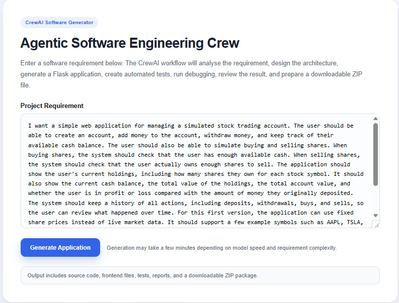
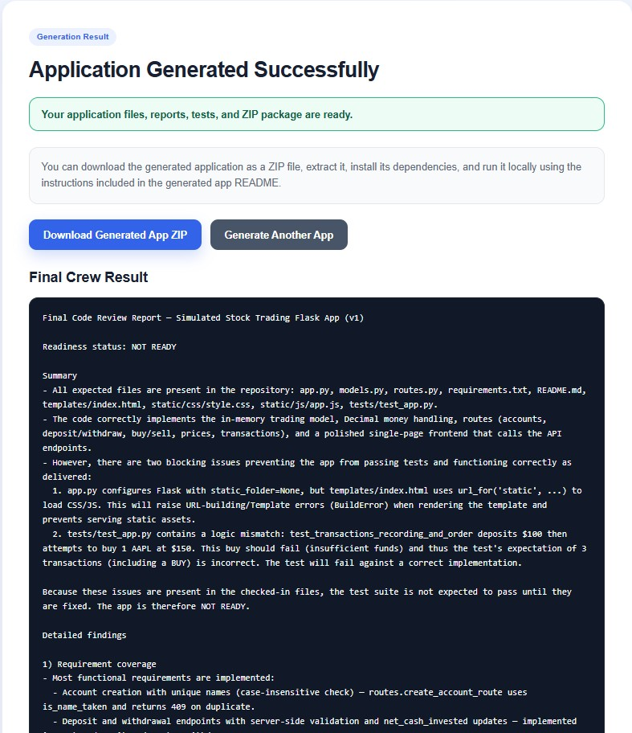
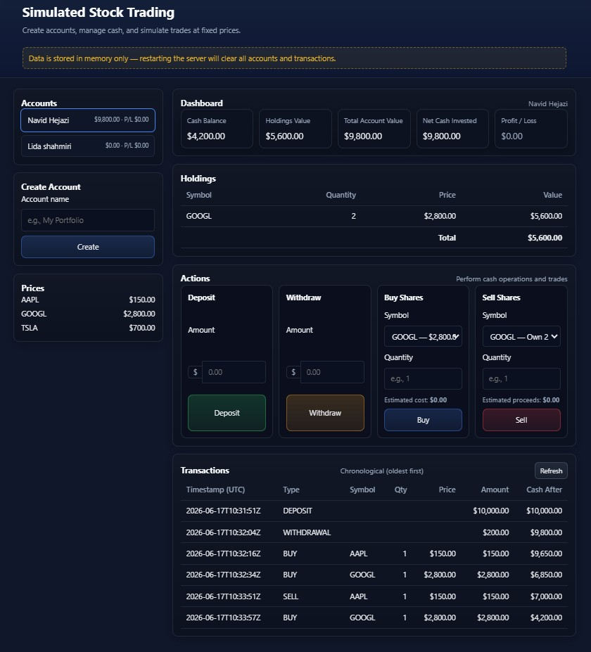

# Agentic Software Engineering Crew

A CrewAI-based multi-agent software engineering workflow that converts natural-language software requirements into a runnable Flask web application.

The system analyses a user requirement, designs the software architecture, generates backend and frontend files, creates automated pytest tests, runs debugging, performs code review, and prepares a downloadable ZIP package containing the generated application.

This project demonstrates an agentic software engineering pipeline where specialist AI agents collaborate in a structured development workflow.

---

## Latest Update

This version adds a **browser-based software generator UI** on top of the CrewAI workflow.

Users can now:

* Open a web interface.
* Enter or edit a software requirement.
* Click **Generate Application**.
* See a loading screen while the agents are working.
* Download the generated Flask application as a ZIP file.
* Review generated reports in the `outputs/` folder.

The new UI is implemented using:

```text
web_app.py
templates/generator_index.html
templates/generator_result.html
```

Each time a new application is generated, the previous `outputs/` folder is cleared so the workflow starts from a clean state.

---

## Screenshots

### Software Generator UI

This page allows the user to enter a software requirement and start the CrewAI generation workflow.



---

### Generation Result Page

After the workflow finishes, the user can download the generated application ZIP package.



---

### Example Generated Application

The example below shows a generated **Simulated Stock Trading Dashboard** Flask application.



---

## Project Overview

The **Agentic Software Engineering Crew** takes a user-provided software requirement and generates a complete Flask application inside:

```text
outputs/generated_app/
```

The generated application can include:

* Flask backend source code
* Frontend HTML, CSS, and JavaScript
* JSON API routes
* In-memory data models
* Automated pytest tests
* `requirements.txt`
* Generated application README
* Requirement analysis report
* Architecture report
* Backend and frontend generation summaries
* Test summary
* Debugging report
* Final code review report
* Downloadable ZIP package

The ZIP package is created at:

```text
outputs/generated_app.zip
```

---

## Latest Example Requirement

The latest tested example uses the following user requirement:

```python
requirements = """
I want a simple web application for managing a simulated stock trading account.

The user should be able to create an account, add money to the account, withdraw money, and keep track of their available cash balance.

The user should also be able to simulate buying and selling shares. When buying shares, the system should check that the user has enough available cash. When selling shares, the system should check that the user actually owns enough shares to sell.

The application should show the user's current holdings, including how many shares they own for each stock symbol. It should also show the current cash balance, the total value of the holdings, the total account value, and whether the user is in profit or loss compared with the amount of money they originally deposited.

The system should keep a history of all actions, including deposits, withdrawals, buys, and sells, so the user can review what happened over time.

For this first version, the application can use fixed share prices instead of live market data. It should support a few example symbols such as AAPL, TSLA, and GOOGL.

The application should have a clean browser interface where the user can manage the account, make trades, view holdings, see profit or loss, and review transaction history.

This is only a first version, so it does not need real user login, real payment processing, live stock prices, or a database. The data can be stored in memory while the app is running.
"""
```

---

## Latest Generated Application

The latest generated application is a **Simulated Stock Trading Dashboard**.

It supports:

* Creating simulated trading accounts
* Depositing funds
* Withdrawing funds
* Preventing withdrawals that would create a negative cash balance
* Buying shares using fixed share prices
* Preventing purchases when the account has insufficient cash
* Selling shares
* Preventing sales of shares that the account does not own
* Viewing holdings by stock symbol
* Viewing fixed share prices
* Calculating cash balance
* Calculating holdings value
* Calculating total account value
* Calculating profit or loss
* Viewing transaction history
* Using a Flask JSON API
* Running automated pytest tests

The generated dashboard provides a clean browser interface where a user can manage accounts, perform trading actions, and review account performance.

---

## Key Features

* Browser-based requirement input form
* Loading overlay while generation is running
* Multi-agent CrewAI software generation workflow
* Requirement analysis from natural-language input
* Architecture planning before implementation
* Flask backend code generation
* Frontend generation with HTML, CSS, and vanilla JavaScript
* Automated pytest test generation
* Test execution through a custom test runner tool
* Debugging agent that can inspect files, run tests, and fix issues
* Final code review agent
* Generated source files written to disk
* Downloadable generated application ZIP
* Structured markdown reports in the `outputs/` folder

---

## Agent Workflow

The project uses a sequential CrewAI process:

```text
Requirement Analyst
        ↓
Software Architect
        ↓
Backend Engineer
        ↓
Frontend Engineer
        ↓
Test Engineer
        ↓
Debugging Engineer
        ↓
Code Reviewer
```

Each stage receives context from earlier stages and produces a specific development artefact.

---

## Agents

### Requirement Analyst

Analyses the software requirement and produces:

* Problem summary
* Main users and goals
* Main features
* User stories
* Acceptance criteria
* Functional requirements
* Non-functional requirements
* Assumptions
* Out-of-scope items
* Risks and ambiguities

### Software Architect

Designs the application architecture, including:

* Technology stack
* File structure
* Main modules and responsibilities
* Data model or data structure
* API endpoints
* Frontend behaviour
* Validation strategy
* Error handling strategy
* Testing strategy
* Known limitations

### Backend Engineer

Generates backend implementation files such as:

```text
app.py
models.py
routes.py
requirements.txt
README.md
```

The backend uses Flask and in-memory storage unless the requirement explicitly asks for persistence.

### Frontend Engineer

Generates frontend files such as:

```text
templates/index.html
static/css/style.css
static/js/app.js
```

The frontend uses HTML, CSS, vanilla JavaScript, and `fetch()` calls to communicate with the Flask backend API.

### Test Engineer

Creates automated pytest tests in:

```text
tests/test_app.py
```

The tests cover main success paths, validation errors, and important edge cases.

### Debugging Engineer

Runs the generated pytest test suite using the custom `TestRunnerTool`.

If tests fail, the debugging agent can:

* Read pytest output
* Inspect generated files
* Decide whether the issue is in the backend, frontend, or tests
* Rewrite corrected files
* Re-run tests
* Produce a debugging report

### Code Reviewer

Reviews the final generated application and reports on:

* Requirement coverage
* Backend correctness
* Frontend/backend integration
* Input validation
* Error handling
* Test coverage
* Debugging result
* Maintainability
* Security
* Production readiness
* Suggested improvements

---

## Current Model Configuration

The current agent model setup is:

```yaml
requirement_analyst:
  llm: openai/gpt-5-mini

software_architect:
  llm: openrouter/anthropic/claude-sonnet-4.5

backend_engineer:
  llm: openai/gpt-5

frontend_engineer:
  llm: openai/gpt-5

test_engineer:
  llm: openai/gpt-5-mini

debugging_engineer:
  llm: openai/gpt-5

code_reviewer:
  llm: openai/gpt-5-mini
```

This setup uses stronger models for architecture, backend generation, frontend generation, and debugging, while using lighter models for requirement analysis, testing, and review to reduce runtime and cost.

---

## Custom Tools

This project includes custom CrewAI tools for file handling and testing.

### FileWriterTool

Writes generated source code files into:

```text
outputs/generated_app/
```

This ensures agents create real project files instead of only returning markdown code blocks.

### FileReaderTool

Reads generated files from:

```text
outputs/generated_app/
```

This allows debugging and review agents to inspect generated source code.

### TestRunnerTool

Runs pytest inside the generated application directory:

```text
outputs/generated_app/
```

It returns the full test result, including return code, stdout, and stderr.

---

## Web Generator UI

The project includes a Flask-based UI for running the generation workflow.

### Main Files

```text
web_app.py
templates/generator_index.html
templates/generator_result.html
```

### What Happens When the User Clicks Generate Application

1. The user enters a software requirement in the browser.
2. The frontend shows a loading overlay.
3. `web_app.py` clears the previous `outputs/` folder.
4. `web_app.py` creates a clean `outputs/generated_app/` folder.
5. CrewAI starts the sequential agent workflow.
6. Agents generate reports and source files.
7. The generated app is saved into `outputs/generated_app/`.
8. The generated app is zipped into `outputs/generated_app.zip`.
9. The result page shows whether the ZIP is available.
10. The user can download the generated application.

---

## Output Structure

After running the web generator or CrewAI workflow, outputs are saved under:

```text
outputs/
```

Example structure:

```text
outputs/
├── requirements_analysis.md
├── architecture.md
├── backend_summary.md
├── frontend_summary.md
├── test_summary.md
├── debugging_report.md
├── code_review.md
├── generated_app.zip
└── generated_app/
    ├── app.py
    ├── models.py
    ├── routes.py
    ├── requirements.txt
    ├── README.md
    ├── templates/
    │   └── index.html
    ├── static/
    │   ├── css/
    │   │   └── style.css
    │   └── js/
    │       └── app.js
    └── tests/
        └── test_app.py
```

---

## Running the Web Generator

Start the generator UI:

```bash
python web_app.py
```

Then open:

```text
http://127.0.0.1:8000/
```

Enter a software requirement and click:

```text
Generate Application
```

The UI will show a loading screen while the CrewAI workflow is running.

When generation finishes, the result page provides a download button for:

```text
generated_app.zip
```

---

## Running the Crew from Terminal

You can also run the CrewAI workflow directly:

```bash
crewai run
```

This runs the configured sequential workflow and writes generated artefacts into the `outputs/` folder.

---

## Running the Generated Application

After generation finishes, go to the generated app directory:

```bash
cd outputs/generated_app
```

Install generated app dependencies:

```bash
pip install -r requirements.txt
```

Run the generated Flask application:

```bash
python app.py
```

Then open:

```text
http://127.0.0.1:5000/
```

---

## Running the Generated Tests

From inside the generated app directory:

```bash
cd outputs/generated_app
python -m pytest tests/test_app.py
```

The test result depends on the generated application and the latest debugging stage output.

Check the following files for the latest test status:

```text
outputs/debugging_report.md
outputs/test_summary.md
```

---

## Installation

Clone the repository:

```bash
git clone <your-repository-url>
cd agentic_software_engineering_crew
```

Create and activate a virtual environment:

```bash
python -m venv .venv
```

On Windows:

```bash
.venv\Scripts\activate
```

On macOS/Linux:

```bash
source .venv/bin/activate
```

Install dependencies:

```bash
pip install -r requirements.txt
```

If using CrewAI safe code execution, make sure Docker is installed and running.

---

## Environment Variables

Create a `.env` file in the project root.

Example:

```text
OPENAI_API_KEY=your_openai_api_key_here
OPENROUTER_API_KEY=your_openrouter_api_key_here
```

Do not commit your `.env` file to GitHub.

---

## Project Structure

Main project structure:

```text
agentic_software_engineering_crew/
├── src/
│   └── agentic_software_engineering_crew/
│       ├── config/
│       │   ├── agents.yaml
│       │   └── tasks.yaml
│       ├── tools/
│       │   ├── file_writer_tool.py
│       │   ├── file_reader_tool.py
│       │   └── test_runner_tool.py
│       ├── crew.py
│       └── main.py
├── templates/
│   ├── generator_index.html
│   └── generator_result.html
├── images/
│   ├── Software_generator.jpg
│   ├── Generation_result.jpg
│   └── Queue_management_app.jpg
├── outputs/
├── web_app.py
├── .env
├── requirements.txt
└── README.md
```

---

## Why Sequential Workflow?

This project currently uses:

```python
process=Process.sequential
```

A sequential process is suitable because each step depends on the previous step:

1. Requirements must be analysed before architecture is designed.
2. Architecture should guide backend and frontend generation.
3. Tests should be generated after implementation.
4. Debugging should happen after tests exist.
5. Final review should happen after testing and debugging.

A future version could use a manager agent or hierarchical workflow to dynamically route failed outputs back to the responsible specialist agent.

---

## Current Limitations

This project is an agentic workflow prototype and has some limitations:

* Generation time can be slow when using large models such as GPT-5 and Claude Sonnet.
* The generated application is usually an MVP, not a production-ready system.
* The generated frontend is suitable for demos but may need manual refinement for real users.
* Test coverage is generated automatically and may require review.
* The code review agent may need stronger task instructions to ensure a full review report is always produced.
* Generated outputs are saved to a fixed output directory.
* Each new generation clears the previous `outputs/` folder.
* Running multiple generations at the same time is not currently supported.
* The current workflow is sequential rather than dynamically supervised.
* Generated applications still require human review before production use.

---

## Future Improvements

Planned or possible improvements include:

* Save each generation in a unique run folder.
* Add generation history.
* Add progress updates from the backend instead of only a loading overlay.
* Add a background task queue for long generation jobs.
* Add WebSocket or polling-based live generation status.
* Improve generated frontend testing with Playwright or Selenium.
* Add generated Dockerfiles for generated apps.
* Add database-backed generation history.
* Add support for multiple framework targets such as FastAPI, Django, or React.
* Improve code review reliability.
* Add deployment configuration for generated apps.
* Add model profiles such as fast, balanced, and premium.

---

## Second Commit Summary

This update includes:

* Added browser-based generator UI.
* Added loading overlay while generation is running.
* Added generated application ZIP download flow.
* Added clean output reset before each new generation.
* Updated tasks to be more generic and not tied to one specific example.
* Improved debugging instructions so final pytest output must be real.
* Improved frontend/test instructions to avoid brittle endpoint checks.
* Added latest simulated stock trading generated app example.
* Added example screenshots for README documentation.

---

## Disclaimer

This project is intended as a portfolio and research-style demonstration of agentic software engineering workflows. It is not intended to replace professional software development review, security testing, or production deployment practices without additional validation.

---

## Author

Navid Hejazi
